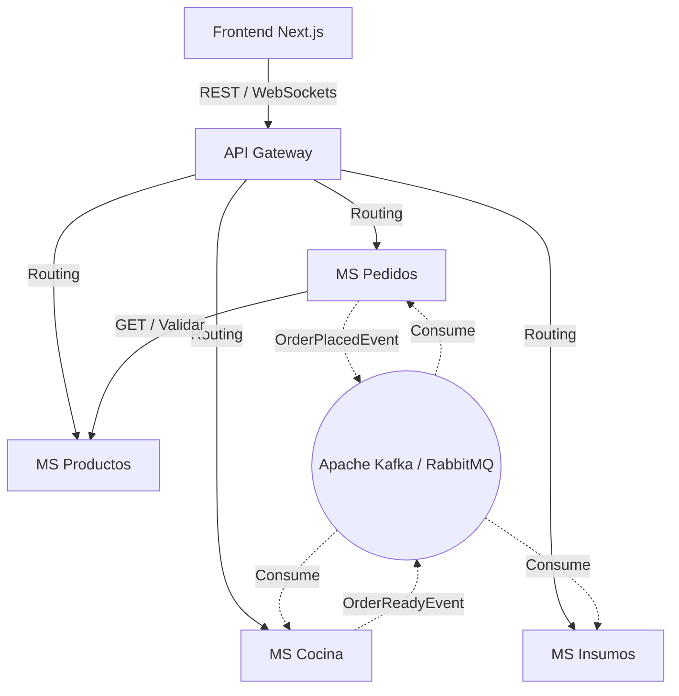

# Arquitectura Backend Enterprise - Le Bon Goût

Este documento detalla la propuesta de arquitectura de microservicios para el sistema de gestión del restaurante "Le Bon Goût", basada en un análisis profundo del frontend (módulos de Mesero, Cocina y OrderContext). La arquitectura propuesta se centra en escalabilidad, alta disponibilidad (Domain-Driven Design), consistencia eventual y comunicación orientada a eventos.

---

## 1. Arquitectura General y Bounded Contexts

El sistema seguirá una arquitectura de **Microservicios distribuidos** apoyados en patrones como **API Gateway**, **Service Discovery (Eureka)** y **Event-Driven Architecture (EDA)**. 

### Bounded Contexts Identificados:
1. **Core Domain (Pedidos y Preparación):** Gestión de órdenes desde que se toman hasta que se sirven.
2. **Catalog Domain (Productos):** Gestión del menú, categorías y precios.
3. **Inventory Domain (Insumos y Mermas):** Stock real de ingredientes.
4. **Support Domain (Proveedores, Reservas, Eventos):** Funciones administrativas y logísticas.

---

## 2. Microservicios Recomendados

Actualmente cuentas con: `eureka`, `gateway`, `proveedores`, `eventos`, `insumos`, `mermas`, `productos`, `reservas`.

### Análisis y Propuestas:
- **CREAR - Microservicio de `pedidos` (Orders):** 
  - **Urgente:** El "mesero" y la "cocina" son interfaces de usuario (Frontend), no son microservicios per se. El backend debe abstraerlos en un servicio de `pedidos`. Este servicio manejará el ciclo de vida de la orden (pending, in_progress, served, paid).
- **CREAR - Microservicio de `cocina` (Kitchen Display System - KDS):**
  - Manejará la lógica de preparación (líneas de preparación, asignación de cocineros, estimación de tiempos).
- **MANTENER:** `eureka`, `gateway`, `productos` (menú), `insumos` (inventario), `mermas`, `proveedores`, `reservas`.
- **REDEFINIR - `eventos`:** Si "eventos" se refiere a eventos de auditorio/restaurante, está bien. Pero si se refería a un *Event Bus*, no debe ser un microservicio de Spring Boot, sino un Message Broker (como Apache Kafka o RabbitMQ). Para este documento, asumimos que usarás RabbitMQ o Kafka para mensajería y que el MS de `eventos` es para eventos del restaurante (cumpleaños, reservas especiales).

---

## 3. Análisis de las Decisiones del Usuario

### A. "El módulo mesero solamente debería conectarse mediante OpenFeign con el microservicio productos..."
**Análisis: INCORRECTO arquitectónicamente.**
1. **El Mesero es un Actor, no un Dominio Backend:** El frontend de mesero se conecta a través del API Gateway. El tráfico es REST/HTTP.
2. **Si te refieres a un MS de Mesero:** No deberías tener un MS llamado "mesero". Deberías tener el MS de `pedidos`.
3. **Comunicación:** El MS de `pedidos` **sí** puede usar `OpenFeign` para conectarse a `productos` y validar si un producto existe o su precio actual antes de confirmar la orden, PERO no para el flujo principal de modificación de stock. Validar vía Feign es correcto (lectura síncrona), pero alterar inventarios debe ser asíncrono.

### B. "Cocina debería conectarse con mesero, ya que mesero es quien envía los pedidos..."
**Análisis: INCORRECTO (Genera acoplamiento fuerte).**
1. Si el MS de Cocina se cae, el mesero no podría tomar pedidos, lo cual significa pérdida de ventas.
2. **Propuesta:** Desacoplamiento total mediante EDA (Event-Driven Architecture). El MS `pedidos` guarda la orden en base de datos e inmediatamente publica un evento `OrderPlacedEvent` en Kafka/RabbitMQ. El MS `cocina` escucha este evento y lo agrega a su cola de forma asíncrona.

---

## 4. Comunicación Entre Microservicios

- **REST / API Gateway (Síncrono):** Para todas las peticiones desde el Frontend (Next.js) hacia el Backend.
- **OpenFeign (Síncrono):** Para consultas internas de **sólo lectura** que requieren consistencia fuerte inmediata. Ejemplo: `pedidos` consultando a `productos` para validar precio y disponibilidad.
- **Kafka / RabbitMQ (Asíncrono):** Para mutaciones de estado que abarcan múltiples dominios. Core de la coreografía.
- **Server-Sent Events (SSE) o WebSockets:** Vital para el módulo de Cocina y Mesero. Cuando la cocina actualiza un plato a "preparado", el MS de `cocina` debe notificar al frontend del mesero en *tiempo real* sin que el frontend haga *polling*.

---

## 5. Flujo Completo de Pedidos (Paso a Paso)

1. **Selección:** El Frontend (Mesero) carga productos desde API Gateway -> `productos`.
2. **Creación:** El Mesero envía el payload de la orden a API Gateway -> `pedidos`.
3. **Validación (Síncrona):** `pedidos` usa *OpenFeign* para verificar con `productos` si están disponibles.
4. **Persistencia y Emisión:** `pedidos` guarda la orden en estado `PENDING` y publica `OrderPlacedEvent` en Kafka.
5. **Recepción en Cocina:** `cocina` consume el evento, crea el ticket de preparación y envía actualización por *WebSockets* al KDS (frontend cocina).
6. **Rebaja de Inventario:** `insumos` también consume `OrderPlacedEvent` y descuenta ingredientes (consistencia eventual).
7. **Preparación:** El Chef marca un plato listo. `cocina` publica `OrderItemPreparedEvent`.
8. **Entrega:** El MS `pedidos` escucha, cambia estado a `SERVED` y notifica al frontend del Mesero (vía SSE/WebSockets) que recoja la orden.

---

## 6. Propuesta de Eventos (Event-Driven Architecture)

Usaremos **Coreografía** (cada servicio sabe qué hacer al escuchar un evento) para máxima resiliencia.

| Evento de Integración | Productor | Consumidores | Payload Principal |
|-----------------------|-----------|--------------|-------------------|
| `OrderPlacedEvent` | `pedidos` | `cocina`, `insumos` | `orderId`, `table`, `items[{productId, qty}]` |
| `OrderItemPreparedEvent` | `cocina` | `pedidos` | `orderId`, `itemId`, `chefId` |
| `OrderReadyEvent` | `cocina` | `pedidos` | `orderId`, `table` |
| `OrderCancelledEvent` | `pedidos` | `cocina`, `insumos` | `orderId`, `reason` |

---

## 7. Diseño de Cocina (KDS)

En el frontend analizado (`CocinaPage`), vimos `toggleItemCompletion` y `markOrderServed`. En el backend, esto requiere:
- **Estados de Item:** `PENDING` -> `PREPARING` -> `COMPLETED`.
- **Concurrencia:** Varios cocineros operando la misma pantalla (Optimistic Locking en JPA con `@Version` es obligatorio para evitar que dos chefs marquen el mismo plato a la vez).
- **Cola de Prioridad:** Las órdenes deben ordenarse por `createdAt`. Los VIPs o mesas reservadas podrían tener un flag de prioridad.
- **Tiempos de Preparación (SLA):** El KDS debe monitorear cuánto tiempo lleva una orden y levantar una alerta si supera los 15 minutos (notificando al frontend mediante WebSocket).

---

## 8. Diseño de Mesero

El frontend (`MeseroPage`) muestra `orderItems` (en memoria) y mesas. En el backend:
- **Gestión de Mesas:** El estado de las mesas (libre, ocupada, sucia) debe vivir en el servicio de `pedidos` o en un MS `mesas`.
- **Órdenes Parciales:** Los clientes piden entradas, y luego platos fuertes. El MS `pedidos` debe permitir hacer *Append* (agregar ítems) a una orden `PENDING` o `IN_PROGRESS` existente. Esto detonará un nuevo evento `OrderUpdatedEvent`.
- **Sincronización:** Evitar el `polling` (hacer fetch cada 5 segundos) visto a veces en frontends. Implementar STOMP (WebSockets) en Spring Boot.

---

## 9. Riesgos Arquitectónicos

1. **Race Conditions en Inventario:** Si quedan 2 porciones de Lomo y 2 meseros envían la orden al mismo tiempo. 
   - *Mitigación:* Lock pesimista a nivel de BD en `insumos` o procesamiento secuencial de colas en Kafka por ID de producto.
2. **Caída de RabbitMQ/Kafka:** 
   - *Mitigación:* Patrón **Outbox**. El servicio `pedidos` guarda el evento en una tabla `outbox` en la misma transacción que guarda la orden. Un cronjob lee esa tabla y envía a Kafka.
3. **Exceso de Acoplamiento (Síncrono):** Usar OpenFeign para actualizar estados.
   - *Mitigación:* Prohibir estricamente mutaciones (POST, PUT, DELETE) vía Feign. Feign sólo para GET. Mutaciones por Eventos.

---

## 10. Arquitectura Final Recomendada

### Resumen Técnico Enterprise:
- **Frontend:** Next.js (Server Components para lectura, Client Components para KDS interactivo).
- **Backend:** Spring Boot 3, Spring Cloud (Eureka, Gateway, OpenFeign).
- **Mensajería:** Apache Kafka (para persistencia de eventos y replay) o RabbitMQ.
- **Base de Datos:** PostgreSQL independiente por cada microservicio (Base de datos por servicio).
- **Seguridad:** JWT emitido por un MS `Auth`, validado en el API Gateway.
- **Tiempo Real:** Spring WebSocket (STOMP) en el Gateway o en un servicio de notificaciones dedicado para propagar eventos a Mesero y Cocina.
